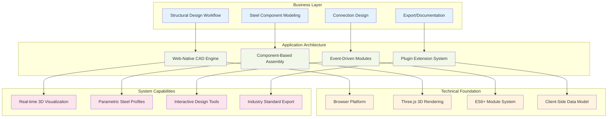
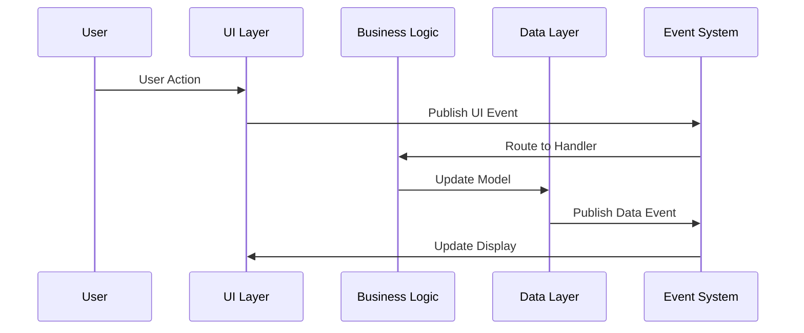

# System Overview

## Business Architecture

TomCAD is designed as a **web-native, plugin-extensible structural steel design platform** that transforms complex CAD workflows into an accessible, collaborative environment. The architecture supports TomCAD's mission to democratize structural steel design while maintaining professional-grade capabilities.

### Strategic Architecture Goals

1. **Zero-Friction Access**: Complete functionality in browser without installation
2. **Rapid Development**: Simple patterns enable fast feature delivery
3. **Market Extensibility**: Plugin architecture supports ecosystem growth
4. **Professional Capability**: Full structural steel workflow support
5. **Collaborative Ready**: Web-native sharing and team collaboration

## System Architecture Philosophy

TomCAD follows a **Progressive Complexity Architecture** - start simple, scale intelligently:

- **V1.0 Foundation**: Web-native simplicity with extensible core
- **V2.0 Evolution**: Performance optimization and advanced features  
- **V3.0 Platform**: Full ecosystem with plugin marketplace

This approach ensures rapid market entry while building toward a comprehensive structural design platform.

## High-Level System Design

## System Architecture Overview

### Business Architecture Layers

**Business Layer** - Domain-specific functionality that delivers value to structural engineers:
- **Structural Design Workflow**: Complete design process from concept to documentation
- **Steel Component Modeling**: Industry-standard structural elements and assemblies
- **Connection Design**: Bolt patterns, welds, and connection detailing
- **Export/Documentation**: Professional drawings and industry-standard file formats

**Application Architecture** - Core software architecture enabling business capabilities:
- **Web-Native CAD Engine**: Browser-based 3D design environment
- **Component-Based Assembly**: Modular element system for complex structures
- **Event-Driven Modules**: Loosely coupled subsystems for extensibility
- **Plugin Extension System**: Third-party integration and custom functionality

**Technical Foundation** - Platform technologies supporting the application:
- **Browser Platform**: Modern web standards, cross-platform compatibility
- **Three.js 3D Rendering**: WebGL-based 3D visualization and interaction
- **ES6+ Module System**: Modern JavaScript architecture without build tools
- **Client-Side Data Model**: Local data management with export capabilities

### Strategic Design Decisions

#### 1. Web-Native Over Desktop Application
**Decision**: Build as progressive web application instead of traditional desktop CAD
**Rationale**: 
- Zero installation friction drives adoption
- Automatic updates eliminate version management
- Cross-platform compatibility from day one
- Collaborative features built into platform

#### 2. Simplicity-First Development Philosophy
**Decision**: Prioritize development speed and code clarity over performance optimization
**Rationale**:
- Faster time-to-market for core features
- Lower technical debt during rapid iteration
- Easier onboarding for contributing developers
- Performance optimization after market validation

#### 3. Plugin Architecture from Foundation
**Decision**: Design extension system before implementing all core features
**Rationale**:
- Enable third-party ecosystem development
- Support specialized industry requirements
- Create revenue opportunities through marketplace
- Maintain competitive advantage through openness

#### 4. Component-Based Assembly Model
**Decision**: Treat all structural elements as composable components
**Rationale**:
- Mirrors real-world construction assembly process
- Enables complex structure modeling
- Supports parametric design workflows
- Facilitates automated documentation generation

### Technology Strategy

#### Current Technology Stack (V1.0)
- **Frontend**: Vanilla JavaScript ES6+ modules
- **3D Rendering**: Three.js WebGL library
- **UI Framework**: Custom event-driven components
- **Data Storage**: Client-side JSON with localStorage
- **Build System**: None (direct file loading)

#### Technology Evolution Path
- **V1.0**: Proven web technologies, rapid development
- **V2.0**: Performance optimizations, advanced features
- **V3.0**: Cloud integration, real-time collaboration

#### Why No Build System Initially
The decision to avoid webpack/build tools enables:
- Immediate development setup (no configuration)
- Direct debugging (no source maps needed)
- Simple deployment (static file hosting)
- Lower barrier to contribution

## Core System Design

### Application Orchestration Layer

The system uses a **centralized orchestrator pattern** where a single coordinator manages all subsystems:

- **Single Entry Point**: BeamViewer acts as application bootstrap and lifecycle manager
- **Dependency Management**: Controlled initialization sequence ensures proper startup
- **Event Coordination**: Central hub manages all inter-module communication
- **State Management**: Global application state with event-driven updates

### Module Communication Architecture

**Event-Driven Messaging System**:
- **Decoupled Modules**: No direct dependencies between functional modules
- **Standardized Events**: Consistent event naming and payload structure
- **Plugin Integration**: External modules integrate through same event system
- **Testing Support**: Event mocking enables isolated unit testing

### Data Architecture Strategy

**Client-Side Data Management**:
- **Local Data Store**: All design data maintained in browser memory
- **Structured Models**: `struktura.js` for project data, `profiles.js` for steel specifications
- **Export-Driven**: Data structured for industry-standard export formats
- **Version Migration**: Schema evolution support for future data model changes

**Regenerative Consistency Model**:
- **Brute-Force Updates**: Complete scene regeneration ensures data consistency
- **Visual Accuracy**: Three.js scene always matches data model exactly
- **Simplified Debugging**: No complex state synchronization logic
- **Performance Trade-off**: Simple implementation over optimization

### Plugin Extension System

**Component Registry Pattern**:
- **Runtime Registration**: New element types registered dynamically
- **Metadata-Driven UI**: User interface automatically generated from component definitions
- **Consistent Integration**: All extensions follow same patterns and interfaces
- **Future Marketplace**: Architecture ready for plugin ecosystem

### System Scalability Design

**Performance Strategy**:
- **Progressive Enhancement**: Start simple, optimize systematically
- **Profiling-Driven**: Performance improvements based on real usage patterns
- **Modular Optimization**: Optimize individual subsystems without architectural changes
- **Maintainable Performance**: Keep optimizations understandable and testable

**Deployment Scalability**:
- **Static File Hosting**: Simple deployment requirements
- **CDN Ready**: All assets can be globally distributed
- **Offline Capable**: Progressive Web App features for disconnected use
- **Mobile Responsive**: Touch-friendly interface for tablet use

### Integration Architecture

**Industry Standard Support**:
- **IFC Export**: Building Information Modeling standard compliance
- **DWG/DXF**: AutoCAD compatibility for industry workflow integration
- **PDF Generation**: Professional documentation output
- **Data Exchange**: Open format support for interoperability

**Future Integration Points**:
- **Cloud Storage**: Google Drive, Dropbox, SharePoint integration
- **Collaboration**: Real-time multi-user editing capabilities
- **Analysis Integration**: Structural analysis software connectivity
- **ERP Integration**: Construction management system integration

This high-level architecture enables TomCAD to start as a simple web-based design tool while maintaining the flexibility to evolve into a comprehensive structural design platform serving the global construction industry.