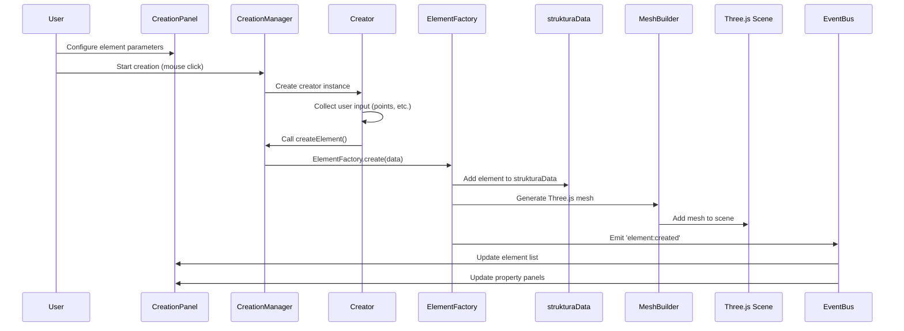
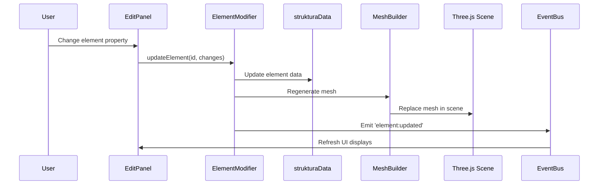
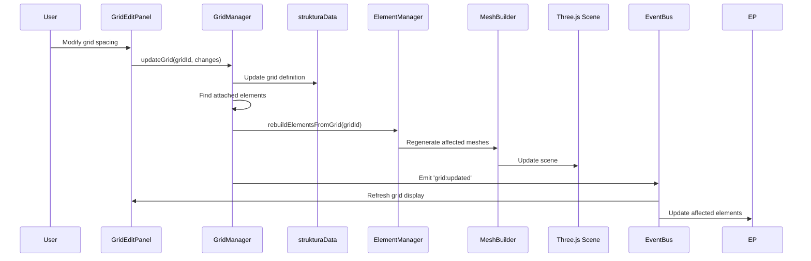
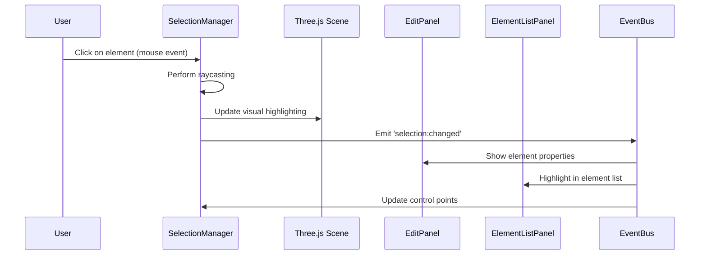

# Data Flow

## Overview

TomCAD implements a **centralized data model** with **event-driven updates** to maintain consistency between the data layer, 3D visualization, and user interface. The data flow follows predictable patterns that make the system easy to understand and extend.

## Central Data Model

### Primary Data Structure

All application data is stored in the global `strukturaData` object:

```javascript
const strukturaData = {
    meta: {
        version: "1.0.0",
        units: "mm",
        created: 1640995200000,
        modified: 1640995200000,
        author: "User",
        description: "Steel structure project"
    },
    elements: [
        {
            id: "BEAM_001",
            type: "beam",
            profile: "IPE200",
            material: "S355JR",
            startPoint: [0, 0, 0],
            endPoint: [5000, 0, 0],
            rotation: 0,
            operations: ["HOLE_001", "CUT_001"],
            gridAttachments: {
                start: { gridId: "GRID_001", intersection: "A-1" },
                end: { gridId: "GRID_001", intersection: "B-1" }
            },
            created: 1640995200000,
            modified: 1640995200000
        }
    ],
    operations: [
        {
            id: "HOLE_001",
            type: "hole",
            targetElement: "BEAM_001",
            position: [2500, 0, 0],
            diameter: 20,
            created: 1640995200000
        }
    ],
    grids: [
        {
            id: "GRID_001",
            name: "Main Grid",
            type: "rectangular",
            origin: [0, 0, 0],
            xSpacings: [5000, 5000, 5000],
            ySpacings: [6000, 6000],
            zLevels: [0, 3000, 6000],
            labels: {
                x: ["A", "B", "C", "D"],
                y: ["1", "2", "3"],
                z: ["L0", "L1", "L2"]
            }
        }
    ]
};
```

### Secondary Data Sources

| Data Source | Purpose | Content |
|------------|---------|---------|
| `profilesData` | Steel profiles database | Profile geometries, properties, standards |
| `beamObjects` | Three.js meshes | Map of element IDs to Three.js objects |
| UI State | Interface state | Panel visibility, selected tools, etc. |

## Core Data Flow Patterns

### 1. Element Creation Flow



**Code Example**:
```javascript
// In BeamCreator.execute()
const elementData = {
    type: 'beam',
    profile: this.getParameterValue('profile'),
    startPoint: this.startPoint,
    endPoint: this.endPoint,
    material: this.getParameterValue('material')
};

// CreationManager handles the actual creation
this.creationManager.createElement(elementData);
```

### 2. Element Modification Flow



**Code Example**:
```javascript
// In EditPanel
updateElementProperty(elementId, propertyName, newValue) {
    const changes = { [propertyName]: newValue };
    ElementModifier.updateElement(elementId, changes);
}

// In ElementModifier
static updateElement(elementId, changes) {
    const element = strukturaData.elements.find(e => e.id === elementId);
    Object.assign(element, changes);
    element.modified = Date.now();
    
    this.regenerateMesh(elementId);
    EventBus.publish('element:updated', { elementId, changes });
}
```

### 3. Parametric Grid Update Flow



**Code Example**:
```javascript
// GridManager.updateGrid()
updateGrid(gridId, changes) {
    const grid = strukturaData.grids.find(g => g.id === gridId);
    Object.assign(grid, changes);
    
    // Find elements attached to this grid
    const attachedElements = strukturaData.elements.filter(element => 
        element.gridAttachments && 
        (element.gridAttachments.start?.gridId === gridId ||
         element.gridAttachments.end?.gridId === gridId)
    );
    
    // Rebuild affected elements
    attachedElements.forEach(element => {
        this.recalculateElementFromGrid(element, grid);
    });
    
    EventBus.publish('grid:updated', { gridId, changes, affectedElements });
}
```

### 4. Selection State Flow



## Data Synchronization Strategies

### 1. Brute-Force Regeneration

**Philosophy**: Prioritize correctness over performance
```javascript
// When data changes, regenerate everything affected
regenerateScene() {
    // Clear existing meshes
    this.clearScene();
    
    // Rebuild all elements from data
    strukturaData.elements.forEach(element => {
        const mesh = MeshBuilder.createElement(element);
        this.scene.add(mesh);
        beamObjects.set(element.id, mesh);
    });
    
    // Rebuild grids
    this.regenerateGrids();
    
    // Rebuild operations
    this.applyOperations();
}
```

**Benefits**:
- Guaranteed data consistency
- Simple to understand and debug
- No complex state management needed

**Trade-offs**:
- Performance cost for large models
- Suitable for architectural modeling scale

### 2. Event-Driven Updates

**Granular Updates**: Only update what changed
```javascript
EventBus.subscribe('element:updated', ({ elementId, changes }) => {
    // Only regenerate the specific element
    const mesh = beamObjects.get(elementId);
    if (mesh) {
        const element = strukturaData.elements.find(e => e.id === elementId);
        const newMesh = MeshBuilder.createElement(element);
        
        // Replace mesh in scene
        this.scene.remove(mesh);
        this.scene.add(newMesh);
        beamObjects.set(elementId, newMesh);
    }
});
```

### 3. Parametric Relationship Management

**Grid Attachments**: Elements automatically update when grids change
```javascript
// Element definition with grid attachment
const beamElement = {
    id: "BEAM_001",
    type: "beam",
    gridAttachments: {
        start: { gridId: "GRID_001", intersection: "A-1" },
        end: { gridId: "GRID_001", intersection: "B-1" }
    }
};

// When grid changes, recalculate element positions
recalculateElementFromGrid(element, grid) {
    if (element.gridAttachments.start) {
        element.startPoint = this.getGridIntersection(
            grid, 
            element.gridAttachments.start.intersection
        );
    }
    
    if (element.gridAttachments.end) {
        element.endPoint = this.getGridIntersection(
            grid, 
            element.gridAttachments.end.intersection
        );
    }
    
    element.modified = Date.now();
}
```

## Data Validation and Integrity

### Element ID Management
```javascript
class ElementFactory {
    static generateId(type) {
        const existing = strukturaData.elements.filter(e => e.type === type);
        const maxNum = existing.reduce((max, el) => {
            const match = el.id.match(new RegExp(`${type.toUpperCase()}_(\\d+)`));
            return match ? Math.max(max, parseInt(match[1])) : max;
        }, 0);
        return `${type.toUpperCase()}_${String(maxNum + 1).padStart(3, '0')}`;
    }
}
```

### Reference Integrity
```javascript
// When deleting an element, clean up references
static deleteElement(elementId) {
    // Remove from main array
    strukturaData.elements = strukturaData.elements.filter(e => e.id !== elementId);
    
    // Remove operations targeting this element
    strukturaData.operations = strukturaData.operations.filter(
        op => op.targetElement !== elementId
    );
    
    // Clean up Three.js objects
    const mesh = beamObjects.get(elementId);
    if (mesh) {
        this.scene.remove(mesh);
        beamObjects.delete(elementId);
    }
    
    EventBus.publish('element:deleted', { elementId });
}
```

## Performance Considerations

### Memory Management
```javascript
// Clean up Three.js resources
cleanupMesh(mesh) {
    if (mesh.geometry) mesh.geometry.dispose();
    if (mesh.material) {
        if (Array.isArray(mesh.material)) {
            mesh.material.forEach(material => material.dispose());
        } else {
            mesh.material.dispose();
        }
    }
}
```

### Batch Operations
```javascript
// Batch multiple changes to avoid repeated regeneration
class BatchUpdater {
    constructor() {
        this.changes = [];
        this.timeout = null;
    }
    
    addChange(change) {
        this.changes.push(change);
        this.scheduleUpdate();
    }
    
    scheduleUpdate() {
        if (this.timeout) clearTimeout(this.timeout);
        this.timeout = setTimeout(() => {
            this.applyChanges();
            this.changes = [];
        }, 16); // Next frame
    }
}
```

## Debugging Data Flow

### Event Tracing
```javascript
// Development helper for tracing events
if (window.DEBUG_EVENTS) {
    const originalPublish = EventBus.publish;
    EventBus.publish = function(eventName, data) {
        console.log(`[EVENT] ${eventName}:`, data);
        return originalPublish.call(this, eventName, data);
    };
}
```

### Data State Inspection
```javascript
// Console debugging helpers
window.debugData = {
    showStructure: () => console.log(strukturaData),
    showElement: (id) => console.log(strukturaData.elements.find(e => e.id === id)),
    showMeshes: () => console.log(beamObjects),
    validateReferences: () => this.validateDataIntegrity()
};
```

This data flow architecture ensures that TomCAD maintains data consistency while providing the flexibility needed for complex parametric relationships and real-time user interactions.