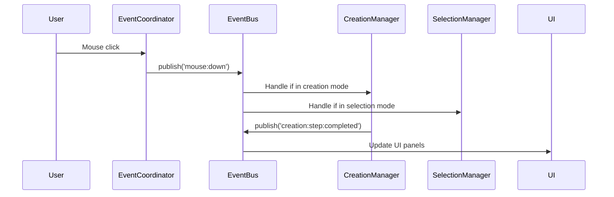
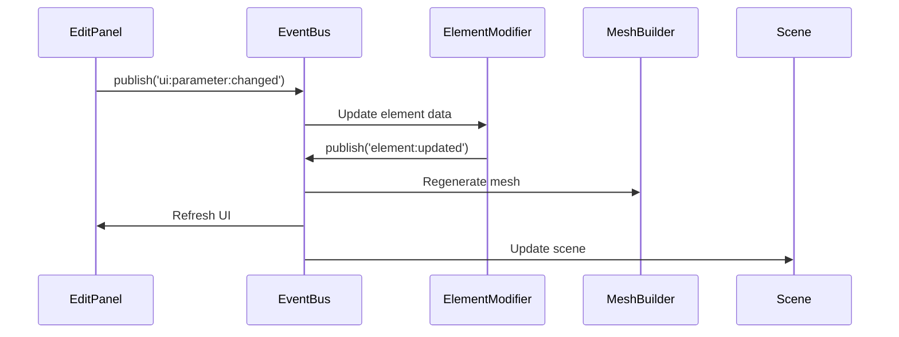
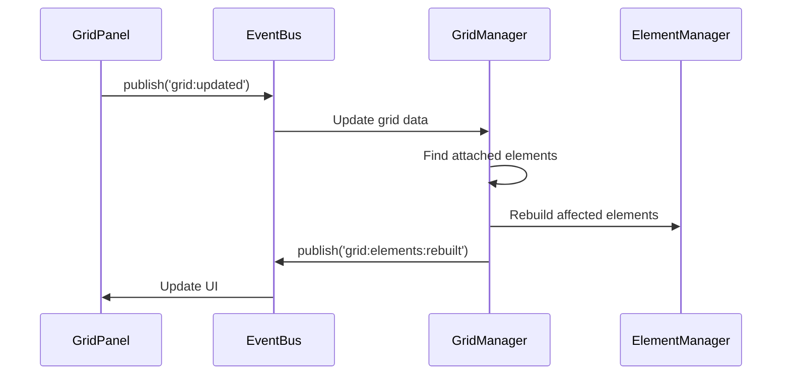

# Event System

## Overview

TomCAD uses a **centralized event-driven architecture** based on the publish-subscribe pattern. The `EventBus` serves as the communication hub, enabling loose coupling between modules while maintaining clear data flow.

## EventBus Implementation

### Core EventBus Class

```javascript
class EventBus {
    static events = new Map();
    static debugMode = false;
    
    /**
     * Subscribe to an event
     * @param {string} eventName - Name of the event
     * @param {function} callback - Function to call when event is published
     * @returns {function} Unsubscribe function
     */
    static subscribe(eventName, callback) {
        if (!this.events.has(eventName)) {
            this.events.set(eventName, []);
        }
        
        this.events.get(eventName).push(callback);
        
        if (this.debugMode) {
            console.log(`[EventBus] Subscribed to: ${eventName}`);
        }
        
        // Return unsubscribe function
        return () => this.unsubscribe(eventName, callback);
    }
    
    /**
     * Publish an event to all subscribers
     * @param {string} eventName - Name of the event
     * @param {*} data - Data to pass to subscribers
     */
    static publish(eventName, data) {
        const callbacks = this.events.get(eventName);
        
        if (this.debugMode) {
            console.log(`[EventBus] Publishing: ${eventName}`, data);
        }
        
        if (callbacks) {
            callbacks.forEach(callback => {
                try {
                    callback(data);
                } catch (error) {
                    console.error(`[EventBus] Error in callback for ${eventName}:`, error);
                }
            });
        }
    }
    
    /**
     * Unsubscribe from an event
     * @param {string} eventName - Name of the event
     * @param {function} callback - Callback function to remove
     */
    static unsubscribe(eventName, callback) {
        const callbacks = this.events.get(eventName);
        if (callbacks) {
            const index = callbacks.indexOf(callback);
            if (index > -1) {
                callbacks.splice(index, 1);
            }
        }
    }
    
    /**
     * Remove all subscribers for an event
     * @param {string} eventName - Name of the event
     */
    static clear(eventName) {
        this.events.delete(eventName);
    }
    
    /**
     * Get all event names
     * @returns {string[]} Array of event names
     */
    static getEventNames() {
        return Array.from(this.events.keys());
    }
    
    /**
     * Get subscriber count for an event
     * @param {string} eventName - Name of the event
     * @returns {number} Number of subscribers
     */
    static getSubscriberCount(eventName) {
        const callbacks = this.events.get(eventName);
        return callbacks ? callbacks.length : 0;
    }
}
```

## Event Categories

### 1. User Interaction Events

Events triggered by user mouse and keyboard actions:

```javascript
// Mouse events
EventBus.publish('mouse:down', { 
    button: 0, 
    position: { x: 100, y: 200 }, 
    worldPosition: [1000, 0, 500] 
});

EventBus.publish('mouse:move', { 
    position: { x: 105, y: 205 }, 
    worldPosition: [1025, 0, 525] 
});

EventBus.publish('mouse:up', { 
    button: 0, 
    position: { x: 105, y: 205 } 
});

// Keyboard events
EventBus.publish('key:down', { 
    key: 'Escape', 
    ctrlKey: false, 
    shiftKey: false 
});

// Specialized interaction events
EventBus.publish('viewer:escape', {});
EventBus.publish('viewer:doubleClick', { 
    position: { x: 100, y: 200 } 
});
```

### 2. Creation Workflow Events

Events related to element creation process:

```javascript
// Creation lifecycle
EventBus.publish('creation:started', { 
    type: 'beam', 
    creator: creatorInstance 
});

EventBus.publish('creation:step:completed', { 
    step: 'start_point', 
    data: [0, 0, 0] 
});

EventBus.publish('creation:preview:updated', { 
    previewMesh: mesh 
});

EventBus.publish('creation:completed', { 
    elementId: 'BEAM_001' 
});

EventBus.publish('creation:cancelled', { 
    reason: 'user_escape' 
});
```

### 3. Selection Events

Events for object selection and highlighting:

```javascript
// Selection changes
EventBus.publish('selection:changed', { 
    selectedIds: ['BEAM_001', 'COLUMN_002'], 
    previousIds: ['BEAM_001'] 
});

EventBus.publish('selection:cleared', {});

EventBus.publish('selection:highlighted', { 
    elementId: 'BEAM_001', 
    type: 'hover' 
});

// Control point events
EventBus.publish('controlPoints:shown', { 
    elementId: 'BEAM_001', 
    points: [startPoint, endPoint] 
});

EventBus.publish('controlPoints:dragging', { 
    elementId: 'BEAM_001', 
    pointIndex: 0, 
    newPosition: [1000, 0, 0] 
});
```

### 4. Data Model Events

Events for data changes and synchronization:

```javascript
// Element lifecycle
EventBus.publish('element:created', { 
    elementId: 'BEAM_001', 
    elementData: elementObject 
});

EventBus.publish('element:updated', { 
    elementId: 'BEAM_001', 
    changes: { profile: 'IPE300' }, 
    previousValues: { profile: 'IPE200' } 
});

EventBus.publish('element:deleted', { 
    elementId: 'BEAM_001' 
});

// Grid events
EventBus.publish('grid:created', { 
    gridId: 'GRID_001', 
    gridData: gridObject 
});

EventBus.publish('grid:updated', { 
    gridId: 'GRID_001', 
    changes: { xSpacings: [5000, 5000, 5000] }, 
    affectedElements: ['BEAM_001', 'BEAM_002'] 
});

// Operation events
EventBus.publish('operation:applied', { 
    operationId: 'HOLE_001', 
    targetElement: 'BEAM_001' 
});
```

### 5. UI Events

Events for user interface updates and state:

```javascript
// Panel events
EventBus.publish('panel:opened', { 
    panelType: 'creation', 
    config: uiConfig 
});

EventBus.publish('panel:closed', { 
    panelType: 'edit' 
});

// Parameter changes
EventBus.publish('ui:parameter:changed', { 
    parameterId: 'profile', 
    value: 'IPE300', 
    previousValue: 'IPE200' 
});

// Status updates
EventBus.publish('ui:status:update', { 
    message: 'Beam created successfully', 
    type: 'success', 
    duration: 3000 
});

// Toolbar events
EventBus.publish('toolbar:tool:selected', { 
    toolType: 'beam', 
    previousTool: 'select' 
});
```

### 6. System Events

Events for application state and system operations:

```javascript
// Application lifecycle
EventBus.publish('app:initialized', {});
EventBus.publish('app:ready', {});

// Scene events
EventBus.publish('scene:rebuilt', { 
    elementCount: 15, 
    renderTime: 45 
});

EventBus.publish('scene:rendered', { 
    frameTime: 16.7 
});

// Export/Import events
EventBus.publish('export:started', { 
    format: 'ifc', 
    filename: 'project.ifc' 
});

EventBus.publish('export:completed', { 
    format: 'ifc', 
    filepath: '/downloads/project.ifc' 
});
```

## Event Flow Patterns

### 1. User Interaction Flow



### 2. Data Update Flow



### 3. Grid Parametric Flow



## Event Handler Patterns

### 1. Manager Event Handling

```javascript
class CreationManager extends Manager {
    setupEventListeners() {
        // Subscribe to relevant events
        this.unsubscribers = [
            EventBus.subscribe('mouse:down', this.onMouseDown.bind(this)),
            EventBus.subscribe('mouse:move', this.onMouseMove.bind(this)),
            EventBus.subscribe('viewer:escape', this.onEscape.bind(this)),
            EventBus.subscribe('toolbar:tool:selected', this.onToolSelected.bind(this))
        ];
    }
    
    onMouseDown(eventData) {
        if (this.activeCreator) {
            this.activeCreator.onMouseDown(eventData);
        }
    }
    
    onToolSelected(eventData) {
        if (eventData.toolType !== 'select') {
            this.startCreation(eventData.toolType);
        } else {
            this.stopCreation();
        }
    }
    
    // Cleanup subscriptions
    destroy() {
        this.unsubscribers.forEach(unsubscribe => unsubscribe());
        super.destroy();
    }
}
```

### 2. UI Panel Event Handling

```javascript
class EditPanel {
    constructor() {
        this.setupEventListeners();
        this.element = null;
    }
    
    setupEventListeners() {
        EventBus.subscribe('selection:changed', this.onSelectionChanged.bind(this));
        EventBus.subscribe('element:updated', this.onElementUpdated.bind(this));
        EventBus.subscribe('element:deleted', this.onElementDeleted.bind(this));
    }
    
    onSelectionChanged(eventData) {
        if (eventData.selectedIds.length === 1) {
            this.showElement(eventData.selectedIds[0]);
        } else {
            this.hide();
        }
    }
    
    onElementUpdated(eventData) {
        if (this.element && this.element.id === eventData.elementId) {
            this.refreshDisplay();
        }
    }
    
    onParameterChange(parameterId, value) {
        // Update element and publish change
        ElementModifier.updateElement(this.element.id, { [parameterId]: value });
        
        EventBus.publish('ui:parameter:changed', {
            parameterId: parameterId,
            value: value,
            elementId: this.element.id
        });
    }
}
```

### 3. Component Event Handling

```javascript
class BeamCreator extends BaseCreator {
    constructor(creationManager) {
        super(creationManager);
        this.setupEventListeners();
    }
    
    setupEventListeners() {
        EventBus.subscribe('ui:parameter:changed', this.onParameterChanged.bind(this));
        EventBus.subscribe('viewer:escape', this.onEscape.bind(this));
    }
    
    onParameterChanged(eventData) {
        // Update preview when parameters change
        if (this.preview) {
            this.updatePreview();
        }
    }
    
    onEscape() {
        this.cancel();
        EventBus.publish('creation:cancelled', { type: 'beam' });
    }
}
```

## Event Debugging and Development

### Event Tracing

```javascript
class EventDebugger {
    static enable() {
        EventBus.debugMode = true;
        this.setupTracing();
    }
    
    static setupTracing() {
        const originalPublish = EventBus.publish;
        EventBus.publish = function(eventName, data) {
            console.group(`[EVENT] ${eventName}`);
            console.log('Data:', data);
            console.log('Subscribers:', EventBus.getSubscriberCount(eventName));
            console.trace('Call stack');
            console.groupEnd();
            
            return originalPublish.call(this, eventName, data);
        };
    }
    
    static logEventStats() {
        const stats = {};
        EventBus.getEventNames().forEach(name => {
            stats[name] = EventBus.getSubscriberCount(name);
        });
        
        console.table(stats);
    }
}

// Development helper
window.debugEvents = EventDebugger;
```

### Event Recording and Replay

```javascript
class EventRecorder {
    static events = [];
    static recording = false;
    
    static startRecording() {
        this.events = [];
        this.recording = true;
        
        const originalPublish = EventBus.publish;
        EventBus.publish = function(eventName, data) {
            if (EventRecorder.recording) {
                EventRecorder.events.push({
                    timestamp: Date.now(),
                    event: eventName,
                    data: JSON.parse(JSON.stringify(data))
                });
            }
            return originalPublish.call(this, eventName, data);
        };
    }
    
    static stopRecording() {
        this.recording = false;
        return this.events;
    }
    
    static replay(events, speed = 1) {
        const startTime = events[0].timestamp;
        
        events.forEach(record => {
            const delay = (record.timestamp - startTime) / speed;
            setTimeout(() => {
                EventBus.publish(record.event, record.data);
            }, delay);
        });
    }
}
```

## Event Performance Optimization

### Event Throttling

```javascript
class EventThrottler {
    static throttle(eventName, delay = 16) {
        let lastCall = 0;
        let timeoutId = null;
        
        const originalPublish = EventBus.publish;
        
        EventBus.publish = function(name, data) {
            if (name === eventName) {
                const now = Date.now();
                const timeSinceLastCall = now - lastCall;
                
                if (timeSinceLastCall >= delay) {
                    lastCall = now;
                    return originalPublish.call(this, name, data);
                } else {
                    if (timeoutId) clearTimeout(timeoutId);
                    timeoutId = setTimeout(() => {
                        lastCall = Date.now();
                        originalPublish.call(EventBus, name, data);
                    }, delay - timeSinceLastCall);
                }
            } else {
                return originalPublish.call(this, name, data);
            }
        };
    }
}

// Throttle mouse move events
EventThrottler.throttle('mouse:move', 16); // ~60fps
```

### Event Batching

```javascript
class EventBatcher {
    static batches = new Map();
    
    static batch(eventName, batchDelay = 16) {
        if (!this.batches.has(eventName)) {
            this.batches.set(eventName, {
                events: [],
                timeout: null
            });
        }
        
        const originalPublish = EventBus.publish;
        
        EventBus.publish = function(name, data) {
            if (name === eventName) {
                const batch = EventBatcher.batches.get(name);
                batch.events.push(data);
                
                if (batch.timeout) clearTimeout(batch.timeout);
                batch.timeout = setTimeout(() => {
                    originalPublish.call(EventBus, name + ':batch', batch.events);
                    batch.events = [];
                }, batchDelay);
            } else {
                return originalPublish.call(this, name, data);
            }
        };
    }
}

// Batch parameter changes
EventBatcher.batch('ui:parameter:changed', 100);
```

## Event Best Practices

### 1. Event Naming Conventions

```javascript
// Use category:action:detail pattern
'creation:started'
'creation:step:completed'
'selection:changed'
'element:updated'
'ui:parameter:changed'
'grid:elements:rebuilt'
```

### 2. Event Data Structure

```javascript
// Always include relevant context
EventBus.publish('element:updated', {
    elementId: 'BEAM_001',           // Primary identifier
    changes: { profile: 'IPE300' },  // What changed
    previousValues: { profile: 'IPE200' }, // Previous state
    timestamp: Date.now(),           // When it happened
    source: 'user_edit'              // Why it happened
});
```

### 3. Error Handling

```javascript
class SafeEventHandler {
    static wrap(callback) {
        return function(data) {
            try {
                return callback(data);
            } catch (error) {
                console.error('Event handler error:', error);
                EventBus.publish('error:handler', {
                    error: error.message,
                    stack: error.stack,
                    event: data
                });
            }
        };
    }
}

// Usage
EventBus.subscribe('element:updated', SafeEventHandler.wrap(this.onElementUpdated.bind(this)));
```

This event system provides the backbone for TomCAD's modular architecture, enabling clean separation of concerns while maintaining efficient communication between all application components.