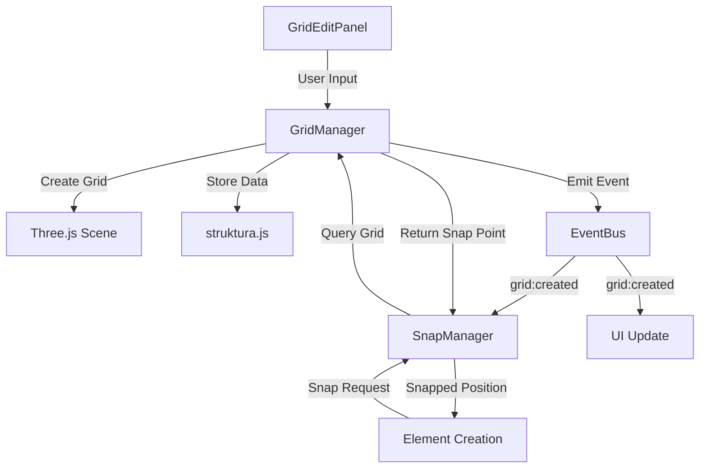

# Construction Grids

Construction grids are the foundation of precise structural modeling in TomCAD. They provide a systematic framework for positioning elements accurately and maintaining dimensional relationships throughout your project.

## Grid Systems Overview

### Purpose of Construction Grids

- **Dimensional Control**: Establish consistent spacing and positioning
- **Parametric Relationships**: Link elements to grid intersections
- **Coordination**: Align structural elements with architectural grids
- **Precision**: Ensure accurate positioning and alignment
- **Efficiency**: Speed up modeling through grid snapping

### Grid Types

TomCAD supports multiple grid systems:

1. **Rectangular Grids**: Standard orthogonal grid system
2. **Radial Grids**: Circular grids with radial and circular lines
3. **Skewed Grids**: Non-orthogonal coordinate systems
4. **Elevation Grids**: Vertical level definitions
5. **Custom Grids**: User-defined coordinate systems

## Rectangular Grid System

### Basic Configuration

Rectangular grids are defined by spacing arrays in X and Y directions:

```yaml
rectangular_grid:
  origin: [0, 0, 0]
  x_spacings: [6000, 6000, 6000, 6000]  # mm
  y_spacings: [5000, 5000, 5000]        # mm
  z_levels: [0, 3000, 6000, 9000]       # mm
```

### Grid Labels

Systematic labeling for clear identification:

```yaml
labels:
  x_direction: ["A", "B", "C", "D", "E"]
  y_direction: ["1", "2", "3", "4"]
  z_direction: ["L00", "L01", "L02", "L03"]
```

### Variable Spacing

Support for non-uniform grid spacing:

```yaml
variable_spacing:
  x_spacings: [4000, 6000, 8000, 6000, 4000]
  y_spacings: [3000, 6000, 6000, 6000, 3000]
  reasoning: "Larger spans in central area"
```

## Creating Grid Systems

### Step-by-Step Grid Creation

1. **Access Grid Tools**
   - Open "Construction Grids" panel
   - Click "New Grid" button
   - Select grid type

2. **Define Grid Origin**
   - Set origin point: `[0, 0, 0]`
   - Choose coordinate system
   - Set rotation if needed

3. **Configure Spacing**
   - Enter X-direction spacings
   - Enter Y-direction spacings
   - Define elevation levels

4. **Set Labels**
   - Choose labeling system
   - Define label prefixes
   - Set label format

5. **Visual Settings**
   - Choose line colors
   - Set line weights
   - Configure visibility

### Grid Configuration Dialog

```yaml
grid_properties:
  name: "Main Structural Grid"
  description: "Primary building grid system"
  
  geometry:
    origin: [0, 0, 0]
    x_spacings: [6000, 6000, 6000]
    y_spacings: [5000, 5000]
    z_levels: [0, 3000, 6000]
  
  labels:
    x_labels: ["A", "B", "C", "D"]
    y_labels: ["1", "2", "3"]
    z_labels: ["Ground", "First", "Second"]
  
  display:
    show_labels: true
    line_color: "blue"
    line_weight: 1
    transparency: 0.7
```

## Radial Grid System

### Circular Grid Configuration

Radial grids for circular or curved structures:

```yaml
radial_grid:
  center: [0, 0, 0]
  radii: [5000, 10000, 15000, 20000]
  angles: [0, 30, 60, 90, 120, 150, 180, 210, 240, 270, 300, 330]
  z_levels: [0, 3000, 6000]
```

### Angular Labeling

```yaml
radial_labels:
  radii: ["R1", "R2", "R3", "R4"]
  angles: ["0°", "30°", "60°", "90°", "120°", "150°", "180°", "210°", "240°", "270°", "300°", "330°"]
  levels: ["L0", "L1", "L2"]
```

## Grid Snapping

### Snap Settings

Configure snapping behavior:

```yaml
snap_settings:
  grid_snap: true
  snap_tolerance: 50  # mm
  snap_priority: "grid_intersection"
  visual_feedback: true
  snap_types:
    - grid_intersection
    - grid_line
    - grid_midpoint
    - grid_quarter_point
```

### Snap Indicators

Visual feedback during snapping:

- **Intersection Points**: Large circles at grid intersections
- **Grid Lines**: Highlighted lines during approach
- **Snap Cursor**: Special cursor when near snap points
- **Coordinate Display**: Shows grid coordinates

### Smart Snapping

Intelligent snapping behavior:

- **Priority System**: Grid intersections have highest priority
- **Magnetic Zones**: Larger snap areas for better usability
- **Contextual Snapping**: Different snap modes for different tools
- **Temporary Override**: Hold Ctrl to disable snapping

## Parametric Grid Relationships

### Element-Grid Linking

Elements can be parametrically linked to grid intersections:

```yaml
parametric_column:
  element_id: "COL_001"
  grid_reference: "A-1"
  level: "L01"
  offset: [0, 0, 0]
  follow_grid: true
```

### Benefits of Parametric Linking

1. **Automatic Updates**: Elements move when grid changes
2. **Design Consistency**: Maintains relationships
3. **Efficiency**: Quick design modifications
4. **Error Reduction**: Prevents positioning mistakes

### Grid Dependencies

Manage relationships between elements and grids:

- **Dependency Tracking**: Know which elements depend on grids
- **Update Notifications**: Alerts when grids change
- **Conflict Resolution**: Handle conflicting constraints
- **Batch Updates**: Update multiple elements simultaneously

## Multi-Level Grids

### Elevation Management

Manage grids across multiple building levels:

```yaml
multi_level_grid:
  base_grid: "Main_Grid"
  levels:
    - name: "Foundation"
      elevation: -500
      grid_modifications: []
    - name: "Ground_Floor"
      elevation: 0
      grid_modifications: []
    - name: "First_Floor"
      elevation: 3000
      grid_modifications:
        - extend_grid: "north"
        - spacing: 4000
    - name: "Roof"
      elevation: 6000
      grid_modifications:
        - reduce_grid: "south"
```

### Level-Specific Modifications

- **Grid Extensions**: Add grid lines at specific levels
- **Grid Reductions**: Remove grid lines where not needed
- **Spacing Changes**: Modify spacing at different levels
- **Local Grids**: Additional grids for specific areas

## Advanced Grid Features

### Grid Intersection Analysis

Analyze grid intersections for optimization:

```yaml
intersection_analysis:
  total_intersections: 48
  used_intersections: 32
  utilization_rate: 66.7%
  unused_intersections: 16
  recommendations:
    - "Consider removing grid line C (low utilization)"
    - "Add intermediate grid between B and C"
```

### Grid Optimization

Optimize grid layout for efficiency:

1. **Utilization Analysis**: Identify underused grid lines
2. **Spacing Optimization**: Suggest optimal spacing
3. **Standardization**: Recommend standard dimensions
4. **Material Efficiency**: Optimize for standard lengths

### Grid Templates

Pre-configured grid templates for common building types:

```yaml
grid_templates:
  office_building:
    description: "Standard office building grid"
    x_spacing: 6000
    y_spacing: 9000
    typical_height: 3000
  
  warehouse:
    description: "Industrial warehouse grid"
    x_spacing: 12000
    y_spacing: 24000
    typical_height: 6000
  
  residential:
    description: "Residential building grid"
    x_spacing: 4000
    y_spacing: 6000
    typical_height: 2800
```

## Grid Visualization

### Display Options

Customize grid appearance:

```yaml
visualization:
  grid_lines:
    color: "blue"
    weight: 1
    style: "solid"
    transparency: 0.5
  
  labels:
    font_size: 12
    color: "black"
    background: "white"
    border: true
  
  intersections:
    show_points: true
    point_size: 3
    color: "red"
```

### View-Dependent Display

- **Zoom-Based**: Show/hide labels based on zoom level
- **View-Specific**: Different display for different views
- **Clipping**: Hide distant grid lines
- **Adaptive**: Adjust display based on model size

## Grid Export and Import

### Export Grid Data

Export grids for use in other applications:

```yaml
export_formats:
  - dxf: "AutoCAD compatibility"
  - ifc: "BIM interoperability"
  - csv: "Spreadsheet analysis"
  - json: "Custom applications"
```

### Import Grid Systems

Import grids from various sources:

- **Architectural Grids**: From architectural models
- **Survey Data**: From site surveys
- **CAD Files**: From existing CAD systems
- **Coordinate Lists**: From spreadsheets

## Best Practices

### Grid Design Guidelines

1. **Standard Dimensions**: Use standard steel lengths
2. **Modular Spacing**: Use consistent, modular dimensions
3. **Structural Logic**: Align with structural requirements
4. **Coordination**: Match architectural grid systems
5. **Future Flexibility**: Allow for future modifications

### Common Grid Spacing

| Building Type | Typical X Spacing | Typical Y Spacing |
|---------------|-------------------|-------------------|
| Office Building | 6000-9000mm | 6000-9000mm |
| Warehouse | 12000-24000mm | 12000-24000mm |
| Residential | 4000-6000mm | 4000-6000mm |
| Retail | 6000-12000mm | 6000-12000mm |
| Industrial | 6000-18000mm | 12000-30000mm |

### Grid Naming Conventions

```yaml
naming_conventions:
  x_direction: ["A", "B", "C", "D", "E", "F"]
  y_direction: ["1", "2", "3", "4", "5", "6"]
  intermediate: ["A.1", "A.2"] # for subdivisions
  levels: ["L00", "L01", "L02"] # level notation
```

## Troubleshooting

### Common Issues

#### Grid Not Visible

**Symptoms**: Grid lines don't appear in the view

**Solutions**:
- Check grid visibility settings
- Verify grid is within view range
- Adjust line weight and color
- Check layer visibility

#### Snapping Not Working

**Symptoms**: Elements don't snap to grid

**Solutions**:
- Enable grid snapping in settings
- Check snap tolerance settings
- Verify grid is active
- Clear any snap overrides

#### Performance Issues

**Symptoms**: Slow response with large grids

**Solutions**:
- Reduce grid density
- Use level-of-detail display
- Limit visible grid range
- Optimize grid complexity

!!! tip "Grid Efficiency"
    
    Use the minimum number of grid lines necessary for your design. Too many grid lines can clutter the view and reduce performance.

!!! warning "Grid Modification"
    
    Be careful when modifying grids that have parametric relationships with elements. Changes to grids will move all linked elements.

---

# Developer Documentation

## Grid System Implementation

### Core Classes and Files

#### GridManager (`src/managers/GridManager.js`)
Main class responsible for grid functionality:

```javascript
class GridManager extends Manager {
    constructor(core) {
        super(core);
        this.grids = new Map();
        this.activeGrid = null;
        this.snapSettings = {
            enabled: true,
            tolerance: 50,
            showVisualFeedback: true
        };
    }
    
    createGrid(config) { /* ... */ }
    deleteGrid(gridId) { /* ... */ }
    updateGrid(gridId, config) { /* ... */ }
    snapToGrid(point) { /* ... */ }
}
```

**Key Methods:**
- `createGrid(config)` - Creates new grid from configuration
- `deleteGrid(gridId)` - Removes grid and updates dependencies  
- `snapToGrid(point)` - Returns nearest snap point
- `getGridIntersections()` - Returns all grid intersection points
- `updateGridVisibility()` - Controls grid display

#### Related Files

**Core Dependencies:**
- `src/core/EventBus.js` - Grid events (`grid:created`, `grid:updated`, `grid:snapped`)
- `src/core/core.js` - Base Manager class
- `src/utils/GeometryUtils.js` - Grid calculations and intersections

**UI Integration:**
- `src/ui/panels/GridEditPanel.js` - Grid creation and editing UI
- `src/managers/UIManager.js` - Panel coordination
- `src/managers/SnapManager.js` - Snapping integration

**Data Storage:**
- `src/data/struktura.js` - Grid definitions stored in project data

### Data Flow



### Grid Data Structure

```javascript
// Grid configuration object
const gridConfig = {
    id: 'grid_001',
    name: 'Main Structural Grid',
    type: 'rectangular', // 'rectangular' | 'radial' | 'custom'
    
    geometry: {
        origin: [0, 0, 0],
        xSpacings: [6000, 6000, 6000],
        ySpacings: [5000, 5000, 5000],
        zLevels: [0, 3000, 6000],
        rotation: 0
    },
    
    labels: {
        xLabels: ['A', 'B', 'C', 'D'],
        yLabels: ['1', '2', '3', '4'],
        zLabels: ['L00', 'L01', 'L02']
    },
    
    display: {
        visible: true,
        color: 0x0066ff,
        lineWidth: 1,
        opacity: 0.7,
        showLabels: true
    },
    
    snap: {
        enabled: true,
        tolerance: 50,
        types: ['intersection', 'line', 'midpoint']
    }
};
```

### Event System Integration

**Events Emitted:**
```javascript
// Grid lifecycle events
EventBus.emit('grid:created', { gridId, config });
EventBus.emit('grid:updated', { gridId, changes });
EventBus.emit('grid:deleted', { gridId });

// Snapping events  
EventBus.emit('grid:snapped', { point, gridId, snapType });
EventBus.emit('grid:snapCancelled', { point });
```

**Events Listened:**
```javascript
// UI panel events
EventBus.on('ui:gridPanel:create', this.handleCreateGrid.bind(this));
EventBus.on('ui:gridPanel:update', this.handleUpdateGrid.bind(this));

// View events
EventBus.on('view:zoomChanged', this.updateGridVisibility.bind(this));
EventBus.on('view:panChanged', this.updateGridCulling.bind(this));
```

### Three.js Integration

#### Grid Geometry Creation
```javascript
createGridGeometry(config) {
    const geometry = new THREE.BufferGeometry();
    const positions = [];
    
    // Create X-direction lines
    config.geometry.ySpacings.forEach((y, index) => {
        const startX = 0;
        const endX = config.geometry.xSpacings.reduce((sum, spacing) => sum + spacing, 0);
        positions.push(startX, y, 0, endX, y, 0);
    });
    
    // Create Y-direction lines  
    config.geometry.xSpacings.forEach((x, index) => {
        const startY = 0;
        const endY = config.geometry.ySpacings.reduce((sum, spacing) => sum + spacing, 0);
        positions.push(x, startY, 0, x, endY, 0);
    });
    
    geometry.setAttribute('position', new THREE.Float32BufferAttribute(positions, 3));
    return geometry;
}
```

#### Grid Material and Rendering
```javascript
createGridMaterial(config) {
    return new THREE.LineBasicMaterial({
        color: config.display.color,
        opacity: config.display.opacity,
        transparent: true,
        depthTest: false,
        renderOrder: -1 // Render behind other objects
    });
}
```

### Snapping Algorithm

```javascript
snapToGrid(worldPoint, tolerance = this.snapSettings.tolerance) {
    const snapPoint = { ...worldPoint };
    let snapInfo = null;
    
    // Check all active grids
    for (const [gridId, grid] of this.grids) {
        if (!grid.snap.enabled) continue;
        
        // Transform to grid local coordinates
        const localPoint = this.worldToGridLocal(worldPoint, grid);
        
        // Find nearest snap points
        const intersectionSnap = this.findNearestIntersection(localPoint, grid, tolerance);
        const lineSnap = this.findNearestGridLine(localPoint, grid, tolerance);
        
        // Choose best snap based on distance and priority
        const bestSnap = this.chooseBestSnap([intersectionSnap, lineSnap]);
        
        if (bestSnap && bestSnap.distance < tolerance) {
            snapPoint.x = bestSnap.point.x;
            snapPoint.y = bestSnap.point.y;
            snapInfo = {
                gridId: gridId,
                snapType: bestSnap.type,
                gridCoordinate: bestSnap.gridCoord
            };
            break; // Use first valid snap
        }
    }
    
    return { point: snapPoint, snapInfo };
}
```

### Performance Considerations

**Grid Culling:**
- Only render grids within view frustum
- Use level-of-detail for complex grids
- Cache grid line calculations

**Memory Management:**
- Reuse geometry buffers when possible
- Dispose unused grid objects properly
- Limit number of active grids

**Optimization Techniques:**
```javascript
// Grid line culling based on view distance
updateGridVisibility(camera) {
    const viewDistance = camera.position.distanceTo(this.sceneCenter);
    const shouldShowLabels = viewDistance < this.labelVisibilityThreshold;
    
    this.grids.forEach(grid => {
        grid.object.visible = grid.config.display.visible;
        grid.labels.visible = shouldShowLabels && grid.config.display.showLabels;
    });
}
```

### Adding New Grid Features

#### 1. Extend Grid Configuration
```javascript
// Add new grid type
const radialGridConfig = {
    type: 'radial',
    geometry: {
        center: [0, 0, 0],
        radii: [5000, 10000, 15000],
        angles: [0, 30, 60, 90, 120, 150, 180, 210, 240, 270, 300, 330],
        zLevels: [0, 3000, 6000]
    }
};
```

#### 2. Implement Grid Creator
```javascript
class RadialGridCreator {
    createGeometry(config) {
        // Implementation for radial grid lines
    }
    
    calculateIntersections(config) {
        // Calculate radial grid intersections
    }
}
```

#### 3. Register with GridManager
```javascript
// In GridManager constructor
this.gridCreators = {
    'rectangular': new RectangularGridCreator(),
    'radial': new RadialGridCreator(),
    'custom': new CustomGridCreator()
};
```

#### 4. Update UI Panel
Add radial grid controls to `GridEditPanel.js`

### Debugging and Testing

**Debug Commands:**
```javascript
// Console debugging
window.debugGrid = {
    showGridData: () => console.log(gridManager.grids),
    testSnapping: (point) => gridManager.snapToGrid(point),
    highlightIntersections: () => gridManager.visualizeIntersections()
};
```

**Common Issues:**
- Grid not snapping: Check `snapSettings.enabled` and tolerance values
- Performance issues: Use grid culling and reduce line count
- Visual artifacts: Adjust renderOrder and depthTest settings
