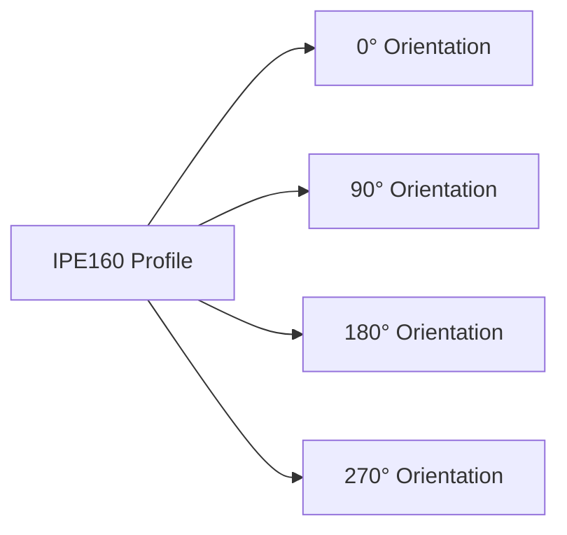

# Steel Profiles

TomCAD includes a **comprehensive global steel profile library** covering structural standards from around the world. Simply select your country or region, and access thousands of standardized profiles used in local construction markets. The system automatically generates precise 3D geometry for each profile, considering all dimensions, fillets, and regional specifications.

## Global Profile Coverage

### Regional Standards Available

**Europe**
- **EN** - European Norms (HEA, HEB, HEM, IPE, UPN, L, RHS, CHS)
- **DIN** - German standards
- **BS** - British standards  
- **NF** - French standards
- **UNI** - Italian standards

**North America**
- **AISC** - American Institute of Steel Construction (W, S, C, L, HSS, Pipe)
- **CISC** - Canadian Institute of Steel Construction (WWF, S, C, L, HSS)

**Asia-Pacific**
- **JIS** - Japanese Industrial Standards (H, I, C, L, RHS, CHS)
- **KS** - Korean standards
- **GB** - Chinese standards (HW, HM, HN, I, C, L, RHS, CHS)
- **AS/NZS** - Australian/New Zealand standards (UB, UC, PFC, EA, RHS, CHS)

**Other Regions**  
- **GOST** - Russian/CIS standards (Б, Ш, С, У, Т, РТР, КТР)
- **IS** - Indian standards
- **SABS** - South African standards
- **CSA** - Canadian standards

### Intelligent Country Selection

The profile library adapts automatically based on your project location:

```yaml
project_settings:
  country: "Germany"
  standard: "DIN EN"
  available_profiles:
    - HEA/HEB series
    - IPE series  
    - UPN series
    - RHS/CHS hollow sections
    - L angles
  units: "metric"
  material_grades: ["S235", "S355", "S460"]
```

When you select **United States**, you get:
```yaml
project_settings:
  country: "United States"
  standard: "AISC"
  available_profiles:
    - W-shapes
    - S-shapes
    - C-channels
    - L-angles
    - HSS rectangular/square
    - Pipe
  units: "imperial"
  material_grades: ["A992", "A572", "A36"]
```

### Smart Profile Mapping

TomCAD includes intelligent cross-reference mapping between international standards:

- **Equivalent profiles**: Find similar profiles in different standards
- **Substitution suggestions**: Alternative profiles when preferred sizes unavailable
- **Capacity matching**: Profiles with similar structural properties across regions
- **Availability alerts**: Regional availability notifications

**Example Cross-Reference:**
```yaml
equivalent_profiles:
  base_profile: "IPE160 (EN)"
  equivalents:
    - "S6x12.5 (AISC)" # Similar depth and capacity
    - "150UB14 (AS)" # Australian equivalent  
    - "H150x75x5x7 (JIS)" # Japanese equivalent
  capacity_match: "±5% section modulus"
```

## Available Profile Types

### HEA Profiles (Wide-flange H-beams)

HEA profiles are standard wide-flange H-beams used primarily as structural columns.

| Profile | h [mm] | b [mm] | tw [mm] | tf [mm] | r [mm] | Mass [kg/m] |
|---------|--------|--------|---------|---------|---------|-------------|
| HEA100 | 96 | 100 | 5 | 8 | 12 | 16.7 |
| HEA120 | 114 | 120 | 5 | 8 | 12 | 19.9 |
| HEA140 | 133 | 140 | 5.5 | 8.5 | 12 | 24.7 |
| HEA160 | 152 | 160 | 6 | 9 | 15 | 30.4 |
| HEA180 | 171 | 180 | 6 | 9.5 | 15 | 35.5 |
| HEA200 | 190 | 200 | 6.5 | 10 | 18 | 42.3 |
| HEA220 | 210 | 220 | 7 | 11 | 18 | 50.5 |
| HEA240 | 230 | 240 | 7.5 | 12 | 21 | 60.3 |
| HEA260 | 250 | 260 | 7.5 | 12.5 | 24 | 68.2 |
| HEA280 | 270 | 280 | 8 | 13 | 24 | 76.4 |
| HEA300 | 290 | 300 | 8.5 | 14 | 27 | 88.3 |

### IPE Profiles (Standard I-beams)

IPE profiles are standard I-beams used primarily as beams.

| Profile | h [mm] | b [mm] | tw [mm] | tf [mm] | r [mm] | Mass [kg/m] |
|---------|--------|--------|---------|---------|---------|-------------|
| IPE80 | 80 | 46 | 3.8 | 5.2 | 5 | 6.0 |
| IPE100 | 100 | 55 | 4.1 | 5.7 | 7 | 8.1 |
| IPE120 | 120 | 64 | 4.4 | 6.3 | 7 | 10.4 |
| IPE140 | 140 | 73 | 4.7 | 6.9 | 7 | 12.9 |
| IPE160 | 160 | 82 | 5 | 7.4 | 9 | 15.8 |
| IPE180 | 180 | 91 | 5.3 | 8 | 9 | 18.8 |
| IPE200 | 200 | 100 | 5.6 | 8.5 | 12 | 22.4 |
| IPE220 | 220 | 110 | 5.9 | 9.2 | 12 | 26.2 |
| IPE240 | 240 | 120 | 6.2 | 9.8 | 15 | 30.7 |
| IPE270 | 270 | 135 | 6.6 | 10.2 | 15 | 36.1 |
| IPE300 | 300 | 150 | 7.1 | 10.7 | 15 | 42.2 |

### RHS Profiles (Rectangular Hollow Sections)

| Profile | h [mm] | b [mm] | t [mm] | r [mm] | Mass [kg/m] |
|---------|--------|--------|---------|---------|-------------|
| RHS40x20x2 | 40 | 20 | 2 | 3 | 1.78 |
| RHS50x30x3 | 50 | 30 | 3 | 4.5 | 3.45 |
| RHS60x40x3 | 60 | 40 | 3 | 4.5 | 4.31 |
| RHS60x4 | 60 | 60 | 4 | 6 | 8.52 |
| RHS80x40x4 | 80 | 40 | 4 | 6 | 6.88 |
| RHS100x50x4 | 100 | 50 | 4 | 6 | 8.59 |
| RHS120x80x5 | 120 | 80 | 5 | 7.5 | 14.7 |
| RHS140x80x5 | 140 | 80 | 5 | 7.5 | 16.1 |
| RHS160x80x5 | 160 | 80 | 5 | 7.5 | 17.6 |
| RHS200x100x6 | 200 | 100 | 6 | 9 | 26.9 |

### CHS Profiles (Circular Hollow Sections)

| Profile | d [mm] | t [mm] | Mass [kg/m] |
|---------|--------|---------|-------------|
| CHS21.3x2.3 | 21.3 | 2.3 | 1.09 |
| CHS26.9x2.3 | 26.9 | 2.3 | 1.40 |
| CHS33.7x2.6 | 33.7 | 2.6 | 2.07 |
| CHS42.4x2.6 | 42.4 | 2.6 | 2.69 |
| CHS48.3x3.2 | 48.3 | 3.2 | 3.84 |
| CHS60.3x3.6 | 60.3 | 3.6 | 5.41 |
| CHS76.1x3.6 | 76.1 | 3.6 | 6.93 |
| CHS88.9x4 | 88.9 | 4 | 8.77 |
| CHS114.3x4 | 114.3 | 4 | 11.4 |
| CHS139.7x5 | 139.7 | 5 | 17.3 |
| CHS168x6.3 | 168 | 6.3 | 26.8 |
| CHS219.1x8 | 219.1 | 8 | 44.1 |

## Using Profiles in Modelling

### Profile Selection

1. **During element creation**:
   ```
   Tool → Beam → Select profile → IPE160
   ```

2. **Drop-down list** contains all available profiles

3. **Search** by profile name

4. **Grouping** by type (HEA, IPE, RHS, etc.)

### Profile Orientation

Profiles can be rotated in 3D space:

- **0°** - default orientation
- **90°** - 90-degree rotation
- **180°** - 180-degree rotation
- **270°** - 270-degree rotation



### Automatic Properties

After selecting a profile, the system automatically:

- Generates precise 3D geometry
- Calculates element mass
- Determines cross-sectional properties
- Sets material properties

## Geometric Properties

### IPE160 Profile - Example

```yaml
geometry:
  height: 160 mm
  width: 82 mm
  web_thickness: 5 mm
  flange_thickness: 7.4 mm
  fillet_radius: 9 mm
  
properties:
  unit_mass: 15.8 kg/m
  cross_sectional_area: 20.1 cm²
  moment_of_inertia_y: 869 cm⁴
  moment_of_inertia_z: 68.3 cm⁴
  section_modulus_y: 108.7 cm³
  section_modulus_z: 16.7 cm³
```

## Standards and Codes

### European Standards

- **EN 10025** - Hot-rolled structural steel products
- **EN 10210** - Seamless structural hollow sections
- **EN 10219** - Welded structural hollow sections

### International Standards

- **AISC** - American profiles
- **BS** - British profiles
- **DIN** - German profiles
- **GOST** - Russian profiles

## Search and Filtering

### Basic Search

```
Enter profile name: "HEA200"
```

### Advanced Filters

- Filter by profile height
- Filter by unit mass
- Filter by moment of inertia
- Filter by application

### Sorting

- Alphabetically
- By height
- By mass
- By moment of inertia

## Custom Profiles

### Defining Custom Profiles

1. **Profile creator**
2. **Import from DXF**
3. **Dimension parameterisation**
4. **User libraries**

### Welded Built-up Sections

- Welded plate sections
- Composite sections
- Variable height sections

## Availability Checking

### Integration with Suppliers

- Automatic availability checking
- Current material prices
- Delivery schedules
- Alternative profiles

### Databases

- Manufacturer catalogues
- National standards
- Industry codes

## Profile Selection Optimisation

### Optimisation Criteria

- Minimum mass
- Minimum costs
- Material availability
- Standardisation
- Transportation constraints

### Suggested Profiles

The system can suggest optimal profiles based on:

- Applied loads
- Strength requirements
- Deflection limits
- Fire resistance requirements

!!! tip "Tip"
    
    Always check profile availability with steel suppliers before final selection. Some profiles may require special ordering.

!!! warning "Important"
    
    Steel profiles have different strength grades. Ensure the selected material is appropriate for the intended application.