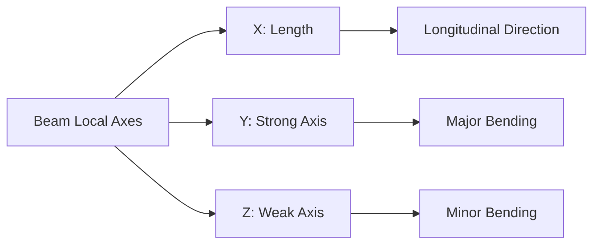

# Beams

Beams are horizontal structural elements designed to carry loads primarily in bending. TomCAD provides comprehensive tools for creating, modifying, and analyzing beam elements with precise geometric and structural properties.

## Beam Types

### Primary Beam Types

| Beam Type | Description | Typical Use |
|-----------|-------------|-------------|
| **Floor Beams** | Main load-bearing beams | Floor structures |
| **Roof Beams** | Roof support beams | Roof structures |
| **Transfer Beams** | Large beams carrying columns | Transfer structures |
| **Tie Beams** | Beams connecting columns | Lateral stability |
| **Girders** | Heavy main beams | Primary structure |
| **Joists** | Secondary beams | Floor/roof decking support |

### Secondary Beam Types

| Beam Type | Description | Typical Use |
|-----------|-------------|-------------|
| **Purlins** | Roof sheet support | Roof cladding |
| **Girts** | Wall sheet support | Wall cladding |
| **Lintels** | Opening support | Doors and windows |
| **Spandrel Beams** | Facade beams | Curtain wall support |
| **Crane Beams** | Crane runway beams | Material handling |

## Creating Beams

### Interactive Creation

1. **Select Beam Tool**
   - Click beam tool icon or press `B`
   - Tool activates with beam cursor

2. **Define Start Point**
   - Click start position
   - Snap to grid intersection
   - Enter coordinates: `[x, y, z]`

3. **Define End Point**
   - Click end position
   - Snap to grid intersection
   - Enter coordinates or offset

4. **Select Profile**
   - Choose from profile library
   - Common beam profiles: IPE, HEA, UPN
   - Custom profiles available

5. **Set Orientation**
   - Default: web vertical
   - Rotate as needed
   - Preview shows orientation

6. **Confirm Creation**
   - Review beam properties
   - Click OK to create

### Parametric Creation

```yaml
beam_parameters:
  start_point: [0, 0, 3000]  # Grid A-1, Level 1
  end_point: [6000, 0, 3000]  # Grid B-1, Level 1
  profile: "IPE200"
  material: "S355JR"
  orientation: 0  # degrees
  camber: 0  # mm
  lateral_support: "top_flange"
```

### Grid-Based Creation

```yaml
grid_based_beam:
  start_grid: "A-1"
  end_grid: "B-1"
  level: "Floor_01"
  offset: [0, 0, 0]
  profile: "IPE200"
  auto_length: true
```

## Beam Properties

### Geometric Properties

```yaml
beam_geometry:
  length: 6000  # mm
  profile: "IPE200"
  height: 200  # mm
  width: 100  # mm
  web_thickness: 5.6  # mm
  flange_thickness: 8.5  # mm
  fillet_radius: 12  # mm
  unit_mass: 22.4  # kg/m
```

### Cross-Section Properties

```yaml
section_properties:
  area: 28.48  # cm²
  moment_inertia_y: 1943  # cm⁴
  moment_inertia_z: 142  # cm⁴
  section_modulus_y: 194.3  # cm³
  section_modulus_z: 28.5  # cm³
  plastic_modulus_y: 220.6  # cm³
  plastic_modulus_z: 44.6  # cm³
```

### Material Properties

```yaml
material_properties:
  grade: "S355JR"
  yield_strength: 355  # MPa
  ultimate_strength: 470  # MPa
  elastic_modulus: 210000  # MPa
  shear_modulus: 81000  # MPa
  density: 7850  # kg/m³
```

## Beam Orientation

### Web Orientation

Beam web can be oriented in different directions:

```yaml
web_orientations:
  vertical: 0    # Standard orientation
  horizontal: 90  # Rotated 90°
  custom: 45     # Custom angle
```

### Strong Axis Orientation

- **Y-axis**: Strong axis (major axis)
- **Z-axis**: Weak axis (minor axis)
- **X-axis**: Longitudinal axis



## Beam Supports

### Support Types

| Support Type | Description | Typical Use |
|-------------|-------------|-------------|
| **Pinned** | No moment transfer | Simple connections |
| **Fixed** | Full moment transfer | Rigid connections |
| **Roller** | Vertical support only | Thermal expansion |
| **Spring** | Flexible support | Foundation modeling |

### Support Definition

```yaml
beam_supports:
  start_support:
    type: "pinned"
    restraints: ["Fx", "Fy", "Fz"]
    releases: ["Mx", "My", "Mz"]
  
  end_support:
    type: "fixed"
    restraints: ["Fx", "Fy", "Fz", "Mx", "My", "Mz"]
    releases: []
```

## Load Application

### Load Types

#### Distributed Loads

```yaml
distributed_load:
  type: "uniform"
  magnitude: 10.0  # kN/m
  direction: [0, 0, -1]  # downward
  start_position: 0  # from beam start
  end_position: 6000  # full length
```

#### Point Loads

```yaml
point_load:
  type: "concentrated"
  magnitude: 50.0  # kN
  direction: [0, 0, -1]  # downward
  position: 3000  # beam midpoint
```

#### Moment Loads

```yaml
moment_load:
  type: "concentrated_moment"
  magnitude: 25.0  # kNm
  axis: [0, 1, 0]  # about Y-axis
  position: 2000  # 2m from start
```

### Load Combinations

```yaml
load_combinations:
  dead_load:
    self_weight: 1.0
    permanent_load: 1.0
  
  live_load:
    imposed_load: 1.0
    movable_load: 1.0
  
  ultimate_limit_state:
    dead_load: 1.35
    live_load: 1.5
```

## Beam Analysis

### Structural Analysis

#### Bending Analysis

```yaml
bending_analysis:
  maximum_moment: 75.0  # kNm
  maximum_shear: 30.0  # kN
  maximum_deflection: 12.5  # mm
  deflection_limit: 24.0  # L/250
```

#### Stability Analysis

```yaml
stability_analysis:
  lateral_torsional_buckling:
    critical_moment: 180.0  # kNm
    reduction_factor: 0.85
    effective_length: 6000  # mm
  
  local_buckling:
    web_slenderness: 35.7
    flange_slenderness: 5.9
    classification: "Class 1"
```

### Code Checking

#### Eurocode 3 Checks

```yaml
eurocode_checks:
  strength_check:
    bending_resistance: 77.9  # kNm
    shear_resistance: 245.0  # kN
    utilization_bending: 0.96
    utilization_shear: 0.12
    status: "PASS"
  
  serviceability_check:
    deflection_limit: 24.0  # mm
    actual_deflection: 12.5  # mm
    utilization: 0.52
    status: "PASS"
```

## Advanced Features

### Curved Beams

Create curved beam elements:

```yaml
curved_beam:
  type: "circular_arc"
  radius: 10000  # mm
  start_angle: 0  # degrees
  end_angle: 90  # degrees
  profile: "IPE200"
  segments: 10  # for analysis
```

### Tapered Beams

Beams with varying cross-section:

```yaml
tapered_beam:
  start_profile: "IPE200"
  end_profile: "IPE300"
  taper_type: "linear"
  length: 6000  # mm
  transition_length: 6000  # full length
```

### Composite Beams

Steel-concrete composite beams:

```yaml
composite_beam:
  steel_profile: "IPE300"
  concrete_slab:
    width: 2000  # mm
    thickness: 150  # mm
    grade: "C25/30"
  
  shear_connectors:
    type: "headed_stud"
    diameter: 19  # mm
    length: 125  # mm
    spacing: 150  # mm
```

## Beam Connections

### Connection Types

#### Simple Connections

```yaml
simple_connection:
  type: "fin_plate"
  plate_thickness: 10  # mm
  plate_depth: 150  # mm
  bolts:
    diameter: 20  # mm
    grade: "8.8"
    quantity: 4
    spacing: 60  # mm
```

#### Moment Connections

```yaml
moment_connection:
  type: "extended_end_plate"
  plate_thickness: 20  # mm
  plate_dimensions: [200, 300]  # mm
  bolts:
    diameter: 24  # mm
    grade: "10.9"
    quantity: 8
    pattern: "rectangular"
```

### Splice Connections

```yaml
beam_splice:
  type: "bolted_splice"
  location: 3000  # mm from start
  plates:
    web_plates: 2
    flange_plates: 4
  bolts:
    diameter: 20  # mm
    grade: "8.8"
    quantity: 16
```

## Fabrication Details

### Cutting and Preparation

```yaml
fabrication_details:
  cutting:
    method: "flame_cutting"
    tolerance: "±2mm"
    end_preparation: "square_cut"
  
  drilling:
    hole_diameter: 22  # mm (M20 bolt)
    hole_tolerance: "+1/0"
    edge_distance: 30  # mm
  
  welding:
    weld_type: "fillet"
    weld_size: 6  # mm
    weld_length: 100  # mm
    electrode: "E7018"
```

### Surface Treatment

```yaml
surface_treatment:
  preparation: "SA2.5"
  primer:
    type: "zinc_rich"
    thickness: 75  # μm
  
  topcoat:
    type: "epoxy"
    thickness: 125  # μm
    color: "grey"
```

## Quality Control

### Inspection Points

```yaml
inspection_points:
  material_check:
    - steel_grade_verification
    - mill_certificate_review
    - dimensional_check
  
  fabrication_check:
    - cutting_accuracy
    - hole_position_accuracy
    - weld_quality
  
  assembly_check:
    - fit_up_quality
    - alignment_check
    - connection_integrity
```

### Testing Requirements

```yaml
testing_requirements:
  non_destructive_testing:
    - ultrasonic_testing
    - magnetic_particle_testing
    - dye_penetrant_testing
  
  destructive_testing:
    - tensile_testing
    - impact_testing
    - hardness_testing
```

## Beam Optimization

### Automatic Optimization

```yaml
optimization_criteria:
  objective: "minimize_weight"
  constraints:
    - strength_utilization: 0.95
    - deflection_limit: "L/250"
    - profile_availability: true
  
  variables:
    - profile_selection
    - material_grade
    - lateral_support_spacing
```

### Multi-Objective Optimization

```yaml
multi_objective:
  objectives:
    - minimize_weight: 0.4
    - minimize_cost: 0.4
    - maximize_standardization: 0.2
  
  pareto_solutions: 10
  optimization_method: "genetic_algorithm"
```

## Common Beam Applications

### Office Buildings

```yaml
office_building_beams:
  typical_spans: [6000, 9000, 12000]  # mm
  typical_profiles: ["IPE200", "IPE240", "IPE300"]
  typical_loads: [5.0, 7.5, 10.0]  # kN/m²
  deflection_limit: "L/250"
```

### Industrial Buildings

```yaml
industrial_building_beams:
  typical_spans: [12000, 18000, 24000]  # mm
  typical_profiles: ["IPE360", "IPE450", "IPE550"]
  typical_loads: [10.0, 15.0, 20.0]  # kN/m²
  deflection_limit: "L/200"
```

### Residential Buildings

```yaml
residential_building_beams:
  typical_spans: [4000, 6000, 8000]  # mm
  typical_profiles: ["IPE140", "IPE160", "IPE200"]
  typical_loads: [3.0, 4.5, 6.0]  # kN/m²
  deflection_limit: "L/300"
```

## Best Practices

### Design Guidelines

1. **Span-to-Depth Ratio**: Maintain economical span/depth ratios
2. **Lateral Support**: Provide adequate lateral support
3. **Connection Planning**: Plan connections early in design
4. **Standardization**: Use standard profiles when possible
5. **Constructability**: Consider construction sequence

### Common Mistakes to Avoid

1. **Inadequate Lateral Support**: Can lead to instability
2. **Ignoring Deflection**: May cause serviceability issues
3. **Poor Connection Design**: Can compromise structural integrity
4. **Material Incompatibility**: Ensure compatible materials
5. **Fabrication Constraints**: Consider fabrication limitations

## Integration Features

### BIM Integration

- **IFC Export**: Full geometric and property data
- **Clash Detection**: Identify interferences
- **Quantity Takeoffs**: Automatic material calculation
- **Drawing Generation**: Automatic detail drawings

### Analysis Integration

- **FEA Models**: Export to finite element analysis
- **Load Transfer**: Automatic load path modeling
- **Results Visualization**: Display analysis results
- **Optimization Loop**: Integrate with optimization tools

!!! tip "Beam Design Tip"
    
    Always consider the construction sequence when designing beams. Temporary supports may be needed during construction, affecting the final design.

!!! warning "Lateral Stability"
    
    Unbraced beam lengths must be carefully considered to prevent lateral-torsional buckling. Provide adequate lateral support at critical points.
